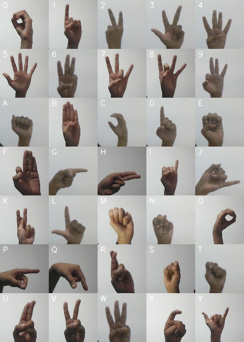

# Indian-sign-language-recognition

Hello, This repository contains python implementation for recognising American Sign Language (ASL) gestures. As there is less research, there is no standard dataset avialable in the web. So, we decided to create our own [dataset](https://drive.google.com/file/d/1KEwaAa_TtXI7yiiRI5PLvNcFwuNQkN7O/view?usp=sharing) of gesture images. ASL dataset have all alphabets (A-Z) and numerics (0-9) with total classes = 35. Each class has 600 images. It uses CNN to train the required models for prediction.

## Gestures

All the gestures used in the dataset are in the shown below image with labels.

## The prerequisites software & libraries for the sign language project are:
* Python (3.7.4)
* IDE (Jupyter & VS Code)
* NumPy (version 1.23.5)
* cv2 (OpenCV) (version 4.7.0.72)
* Keras (version 2.12.0)
* Tensorflow (as Keras uses tensorflow in backend and for image pre-processing)
(version 2.12.0)

## Implementation

The implementation follows several steps:

i) Image segmentation and Preprocessing (Applying gaussian blur & Thresholding)  
ii) A model is created using TensorFlow using CNN  
iii) The model is trained with some samples of data from the database of the images of the words from each word. 
iv) After the model is trained it can be tested to observe the actual working of the system.  

## Results
As the dataset images are much similar, the model has given with accuracy of 70%

A demo can be watched here: 

## Run files

Run files in order: 
**Step 1:** (Optional) To create your own Dataset run

>   python collect-data.py

**Step 2:** If you want to use our dataset download from below and extract it in the root directory of the repository.  Then run

>   python ImagePreprocessing.py

to preprocess all the images (from raw images to Thresholded images).

**Step 3:** To train the the model run the file

>   python train_alpha.ipynb 
>   python train_digit.ipynb

**Step 4:** To visualise the confusion matrix run the file

>   python visualise.py

Dataset can be downloaded from : https://drive.google.com/file/d/1KEwaAa_TtXI7yiiRI5PLvNcFwuNQkN7O/view?usp=sharing

### Credits

- Inspired by the [implementation of Luvk1412](https://github.com/luvk1412/Sign-Language-to-Text)
- https://data-flair.training/blogs/sign-language-recognition-python-ml-opencv/
